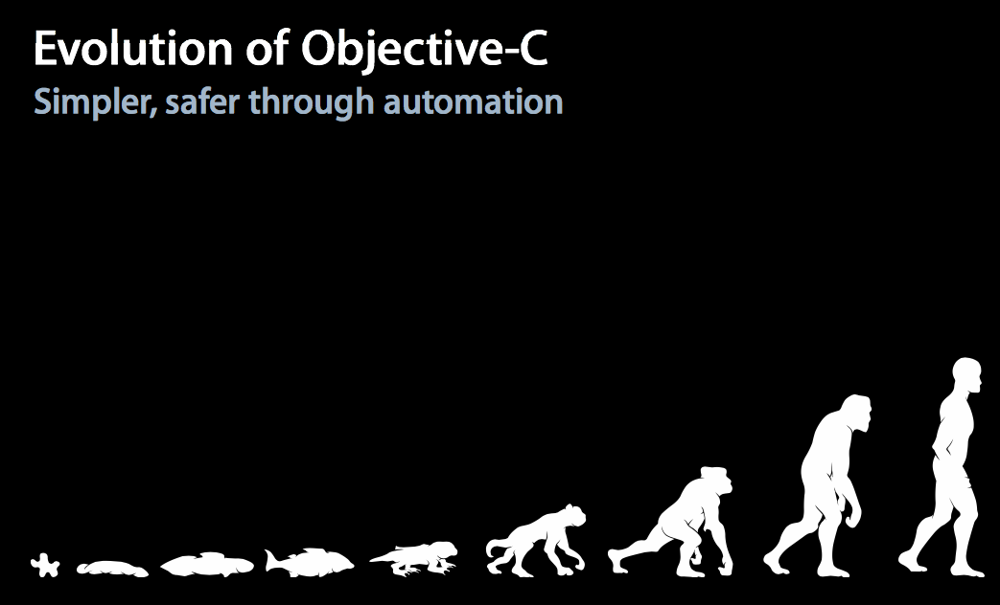

# Lesson 2: How Apple teaches Objective-C
> Previous: [Lesson 1 - Objective-C Walk-trough](bear://x-callback-url/open-note?id=73AB9243-8C60-44E0-B3AC-D604DC860C2A-1511-0000040097ECE2D8)  
> Next: [Lesson 3: Protocols and Bridging](bear://x-callback-url/open-note?id=06F79FE9-4A48-46E5-BAB0-3D111EA5947F-74998-00003292A1E8E08B)  
- - - -
* [WWDC 2012 video 405](https://developer.apple.com/videos/play/wwdc2012/405/)
* [Apple Conceptual intro to objective-C](https://developer.apple.com/library/content/documentation/Cocoa/Conceptual/ProgrammingWithObjectiveC/Introduction/Introduction.html)
- - - -
# WWDC video
<a href='Lesson2-HowAppleTeachesObjective-C/session_405__modern_objectivec.pdf'>session_405__modern_objectivec.pdf</a>



### In this notes a resume and comparison to swift is made.
* Objective-C is full of pointers. Swift too?
* Method ordering is like swift
	* Class extension
* Enums
	* Explicitly typed
	* No type
* Properties
	* Syntesize
	* Core Data syntesize
* Literals: Shorthand notation for stuff you use all the time.
* Initializers
* Static global constants and Objective-C Objects
* ARC: Automatic Reference Counting
- - - -
## Objective-C is full of pointers. Swift too?
In the
```swift
var array = ["C", "d", "A"]
func sort(_ array: [String]) -> [String] {
		return array.sort{<}
}
sort(array)
// print(Array) -> ["C", "d", "A"]
array = sort(array)
// print(Array) -> [ "A", "C", "d"]
func sortInOut(_ array: inout[String]) {
		array.sort{<}
}
sortInOut(array)
// print(Array) -> [ "A", "C", "d"]
````
- - - -
## Method ordering is like swift
Before you had to put the method implementation or declaration before you use it. This is no longer needed.

```objective-c
@interface SongPlayer : NSObject
- (void)playSong:(Song *)song;
@end
@implementation SongPlayer
- (void)playSong:(Song *)song {
  NSError *error; // soort inout
 //In Old objective-C you would have to put this in the header or class extension
  [self startAudio:&error];
  ...
}
- (void)startAudio:(NSError **)error { ... }
@end
```

### Whats is a class extension?
When you write __()__ it is a class extension.
```objective-c
@interface SongPlayer ()
- (void)startAudio:(NSError **)error;
@end
```
- - - -
## Enums
### Enum with explicit types
```objective-c
enum {
    NSNumberFormatterNoStyle,
    NSNumberFormatterDecimalStyle,
    NSNumberFormatterCurrencyStyle,
    NSNumberFormatterPercentStyle,
    NSNumberFormatterScientificStyle,
    NSNumberFormatterSpellOutStyle
};
typedef NSUInteger NSNumberFormatterStyle;
```

Ok but butter to
```objective-c
typedef enum NSNumberFormatterStyle : NSUInteger {
    NSNumberFormatterNoStyle,
    NSNumberFormatterDecimalStyle,
    NSNumberFormatterCurrencyStyle,
    NSNumberFormatterPercentStyle,
    NSNumberFormatterScientificStyle,
    NSNumberFormatterSpellOutStyle
} NSNumberFormatterStyle;
```
Because then you have Strong type checking

You can use them easily in switches:
```objective-c
 switch (style) {
  case NSNumberFormatterNoStyle:
			[foo do];
			break; // Best altijd schrijven want is fall through!!!
  case NSNumberFormatterSpellOutStyle:
			[foo spell];
		break;
}
```
- - - -
## Properties
### Synthesize
```swift
@interface Person : NSObject
@property(nonatomic, strong) Foo * foo;
@end
@implementation Person
-(Foo*)foo {
	return _foo;
}
-(void) setFoo:(Foo *) value {
	_foo = value
}
// Is hetzelfde als @syntesize foo = _foo;

- (void) function {
	NSLog(@"%@", self.foo);
}
@end
```
Always write as less as possible:

```swift
@interface Person : NSObject
@property(strong) NSString *name;
@end
@implementation Person
@end
```

__But__!! for Core Data this is different!
### Core Data Synthesize

```objective-c
@interface Person : NSManagedObject
@property(strong) NSString *name;
@end
@implementation Person
@dynamic name;
@end
```
- - - -
# Literals
Shorthand notation for stuff you use all the time
## Single Literals
### Old NSNumber
```objective-c
NSNumber *value;
value = [NSNumber numberWithChar:'X'];
value = [NSNumber numberWithInt:12345];
value = [NSNumber numberWithUnsignedLong:12345ul];
value = [NSNumber numberWithLongLong:12345ll];
value = [NSNumber numberWithFloat:123.45f];
value = [NSNumber numberWithDouble:123.45];
value = [NSNumber numberWithBool:YES];
```

### Much better
```objective-c
NSNumber *value;
value = @'X';
value = @12345;
value = @12345ul;
value = @12345ll;
value = @123.45f;
value = @123.45;
value = @YES;
```

Also a calculation result can be boxed into an NSNumber
```objective-c
NSNumber *piOverSixteen = @( M_PI / 16 );
```
### Why use NSNumber
1. To store in Core data. You cannot store a Bool, but you can store @YES (is 1 internally)
2. JSON can be made from NSNumber property, not from int
- - - -
### Collection Literals
#### OLD Array creation
```objective-c
NSArray *array;
array = [NSArray array];
array = [NSArray arrayWithObject:a];
array = [NSArray arrayWithObjects:a, b, c, nil];
id objects[] = { a, b, c };
NSUInteger count = sizeof(objects) / sizeof(id);
array = [NSArray arrayWithObjects:objects count:count];
```

#### New Array creation
```objective-c
NSArray *array;
array = @[];
array = @[ a ];
array = @[ a, b, c ];
array = @[ a, b, c ];
```

#### Old Dictionary creation
```objective-c
NSDictionary *dict;
dict = [NSDictionary dictionary];
dict = [NSDictionary dictionaryWithObject:o1 forKey:k1];
dict = [NSDictionary dictionaryWithObjectsAndKeys:
                       o1, k1, o2, k2, o3, k3, nil];
id objects[] = { o1, o2, o3 };
id keys[] = { k1, k2, k3 };
NSUInteger count = sizeof(objects) / sizeof(id);
dict = [NSDictionary dictionaryWithObjects:objects
                                   forKeys:keys
                                     count:count];
```

#### New Dictionary creation
```objective-c
NSDictionary *dict;
dict = @{};
dict = @{ k1 : o1 };
dict = @{ k1 : o1, k2 : o2, k3 : o3 };
```

### Mutable Collections
Use `-mutableCopy`

```objective-c
NSMutableArray *array = [@[1,2] mutableCopy];
```

Then you can do:
```objective-c
[array append: 3];
```
- - - -
## Initializers
```swift
class Foo {
	let name: String
	init(name: String) {
		self.name = name
	}
}
```
In objective-c
[Object Initialization](https://developer.apple.com/library/content/documentation/General/Conceptual/CocoaEncyclopedia/Initialization/Initialization.html)
```objective-c
@interface Foo: NSObject // File 1
@property (nonatomic, strong) NSSString * name;
@end
@implementation Foo // File 2

-(id)init:(NSString *) name {
id anObject = [[Foo alloc] init];
if (anObject) {
anObject.name = name    // more messages...
} else {
    // handle error
return nil
}
return anObject
}
// Shorter version
-(id)init:(NSString *) name {
if (self = [super init]) {
self.name = name    // more messages...
} else {
    // handle error
	return nil
}
return return self
}
@end
```
- - - -
### Initialization happens at runtime -> no constant containers
Because **Objective-C** is a dynamic language you cannot assign Objective-C classes to a global constant. This would mean the memory for this constant global would we allocated at compile time. The compiled code would contain the exact memory needed to execute the program. This is not so with dynamic languages. The memory is allocated at run time.
So you can create in code an array reference, pointer, to a location that at runtime will be given memory space only when the pointer is used in a part of the code that is run. The memory needed to run a dynamic program is therefore smaller then a compile time program. Not all the memory is needed at startup.
```objective-c
// Will give an error
static NSArray const * const thePlanets = @[
  @"Mercury", @"Venus", @"Earth",
  @"Mars", @"Jupiter", @"Saturn",
  @"Uranus", @"Neptune"
];
```

__Use `+initialize`

```objective-c
@implementation MyClass
static NSArray *thePlanets;
+ (void)initialize {
  if (self == [MyClass class]) {
    thePlanets = @[
      @"Mercury", @"Venus", @"Earth",
      @"Mars", @"Jupiter", @"Saturn",
      @"Uranus", @"Neptune"
    ];
} }
```

This does __NOT__ work for Dictionaries because of compiler optimalizations  [See WWDC 2012 video 405](https://developer.apple.com/videos/play/wwdc2012/405/)

## Subscripting and object literals, boxed expressions
With dictionaries and arrays you can do:
__Array__
```objective-c
NSArray* array = @[@1,@2];
NSLog(@"%@", array[1]) // will print 2
```
__Dictionary__
```objective-c
NSDictionary* dict = @{"first": @1, "second": @2}
NSLog(@"%@", dict[@"second"]) // will print 2
```

!! You can make your class _Subscriptable__  [See WWDC 2012 video 405](https://developer.apple.com/videos/play/wwdc2012/405/)
- - - -
## ARC: Automatic Reference Counting
In Objective-C __AND__ Swift you have the __SAME__ memory management!!!!
Swift is no better at handling memory then Objective-C, it just has some language features like @escaping and the use of self to help you.

### How to make a memory leak?
```objective-c

@interface Foo ()
@property (nonatomic, strong) Service* service;
@property (nonatomic, strong) Model* model;
@end

@implementation

- (void) load {
	self.service = [[Service alloc] init];
	[self.service perform: ^ {(Model* model) in
		self.model = model // this is a leak
	}];
}
@end
```

### How to fix it?

```objective-c
@interface Foo ()
@property (nonatomic, strong) Service* service;
@property (nonatomic, strong) Model* model;
@end

@implementation

- (void) load {
	self.service = [[Service alloc] init];
  weak Foo* weakSelf = self
	[self.service perform: ^ {(Model* model) in
		weakSelf.model = model // this is the fix for the leak
	}];
}
@end
```

When you use see memory management becomes more difficult [See WWDC 2012 video 405](https://developer.apple.com/videos/play/wwdc2012/405/)

It bowls down to using stuff like:
```objective-c
NSArray *people = CFBridgingRelease( ABAddressBookCopyPeopleWithName(addressBook,CFSTR("Appleseed")));
```

# Summary
• `@synthesize` by default
• Forward declarations optional
• Fixed underlying type enums
• Literals and subscripting
• Boxed expressions
- - - -
> Previous: [Lesson 1- Objective-C Foundation via Mocks](bear://x-callback-url/open-note?id=73AB9243-8C60-44E0-B3AC-D604DC860C2A-1511-0000040097ECE2D8)  
> Next: [Lesson 3: Protocols and Bridging](bear://x-callback-url/open-note?id=06F79FE9-4A48-46E5-BAB0-3D111EA5947F-74998-00003292A1E8E08B)  
